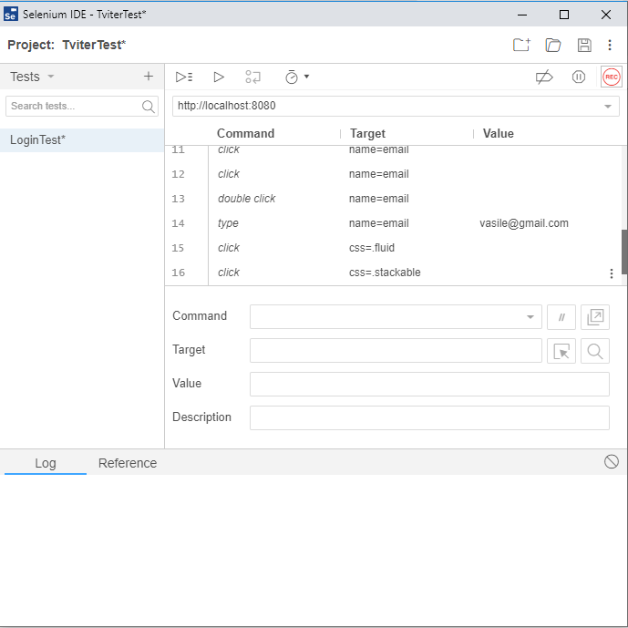
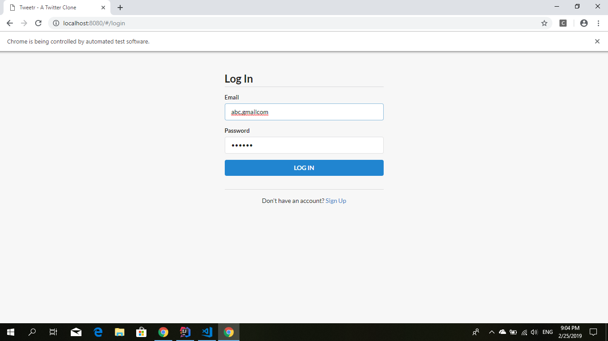
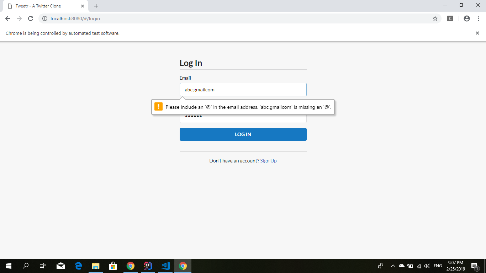

# Laboratory work nr. 1
-----
# Topic : *Testing tool - Selenium*
### Author : *Drumea Vasile*
-----
## Objectives :
1. Instalation and Setup of Selenium;
2. Get familiar with Selenium;
3. Testing the login functionality of an own web app;

## Course of the work :
### Practical Assignments :
1. Install SeleniumIDE plugin in browser and simulate the commands to login using that plugin.
2. Create an app which tests with Selenium the login functionality. 

### Implementations :

1. I've created a test for my fronten Vue.js app in SeleniumIDE first:

2. After, using IntelliJ IDEA and Selenium Web Driver I've created a Java project in which I test the login feature of the app.
The code of the program can be seen here [Source code](https://github.com/Wazea/SeleniumLabs/tree/master/SeleniumIntro/src)

In the following figures is the result of execution :

